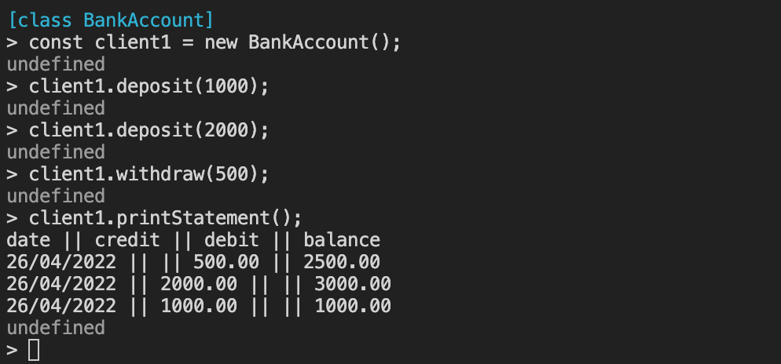

# Tech Test - Bank

[](https://github.com/PKilgarriff/bank_tech_test/actions/workflows/node.js.yml)

## Description

The client has requested a Banking application that runs in the command-line via a [REPL](https://en.wikipedia.org/wiki/Read%E2%80%93eval%E2%80%93print_loop).

The requirements are as follows:

- clients can make a deposit
- clients can make a withdrawal
- clients can print a bank statement
- data can be kept in memory (not stored in a file, or in a database)

A set of acceptance criteria have been provided, and these are demonstrated in the image below, and in one of the feature tests, showing the desired function of the program.



## Technologies

- JavaScript - chosen programming language
- Node.js - JS runtime environment
- Jest - testing both unit and feature tests
- ESLint - linting
- GitHub - version control
- GitHub Actions - Continuous Integration

## Set-up

### Clone Repository

Run the following commands in your terminal.

```zsh
git clone https://github.com/PKilgarriff/bank_tech_test
```

### Install Dependencies

> These steps assume you have [Node.js](https://nodejs.org/en/) running on your system.

```zsh
cd bank_tech_test
npm install
```

### Run Program

This program is run within node as a REPL.

Only the bankAccount.js file needs to be loaded in node as it requires the statementPrinter.js file inside it.

```zsh
cd src
node
```

```node
.load ./bankAccount.js
const client1 = new BankAccount();
client1.deposit(480);
client1.deposit(935);
client1.withdraw(650);
client1.printStatement();
    date || credit || debit || balance
    23/04/2022 || || 650.00 || 765.00
    23/04/2022 || 935.00 || || 1415.00
    23/04/2022 || 480.00 || || 480.00
```

Explanatory errors will be thrown if either a deposit or a withdrawal is attempted with a negative number, or a non-numerical input.

```
> client1.deposit('a big sack of money');
Uncaught 'You cannot deposit a non-numerical amount'
> client1.withdraw(-100000);
Uncaught 'You cannot withdraw a negative amount'
> client1.withdraw(10);
Uncaught 'You cannot withdraw more money than your account currently has'
```

### Test Program

There are npm scripts setup to test and lint the program

```bash
npm run test # Run linter then tests
npm run test:unit # Run tests by themselves
npm run test:coverage # Run tests with Jest's coverage checker
```

If you wish to see the verbose output from Jest, run `jest --verbose`, or you can see the current verbose output [here](./docs/testOutput.md). The test coverage table is [here](#coverage).

## Approach

The program is made up of four classes:

- a BankAccount class that handles the deposit and withdrawal while maintaining the balance
  - instances are created for separate accounts
- a Transaction class that stores the record of each transaction
- a StatementPrinter class that handles the generation of a bank statement for output to terminal
  - the class methods are available for use as no data needs to be stored, and so no instances are required
- a StatementPrinterHelper class that provides static methods for formatting strings into the required output

This structure is to adhere to separation of concerns.

### TL;DR

[Full Approach](./docs/fullApproach.md) is available here.

- Wrote a [design document](./design.md)
- Test-drove the classes
  - Used Red-Green-Commit-Refactor-Commit loop
- When they were sufficiently functional, required StatementPrinter within BankAccount
- Mocked the dependencies in unit tests
- Wrote feature tests to demonstrate overall function
- Brought in continuous integration late in the process
- Tidied up code for review
- Completed Self-assessment form
- Brought in changes that resulted:
  - further encapsulation
  - test behaviour over state
- Received coach feedback
  - implemented further changes

## Next Steps

- ~clarify with client how they would want negative balances handled~ -> Throw error
- ~revisit possibility of a Transaction class to encapsulate further~
- ~redesign bankAccount.test.js to test behaviour instead of state _without_ losing test specificity~

# Appendix

### Coverage

| File                | % Stmts | % Branch | % Funcs | % Lines | Uncovered Line #s |
| ------------------- | ------- | -------- | ------- | ------- | ----------------- |
| All files           | 100     | 100      | 100     | 100     |
| bankAccount.js      | 100     | 100      | 100     | 100     |
| statementPrinter.js | 100     | 100      | 100     | 100     |
| transaction.js      | 100     | 100      | 100     | 100     |
